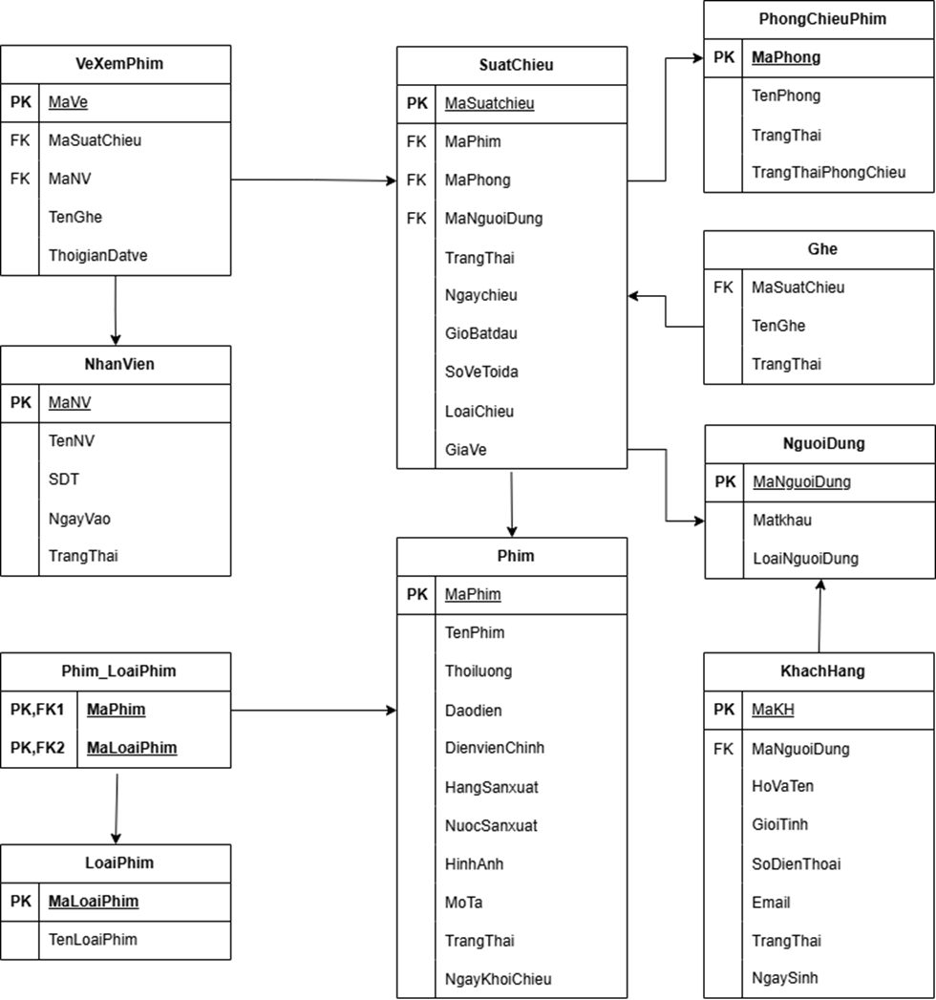
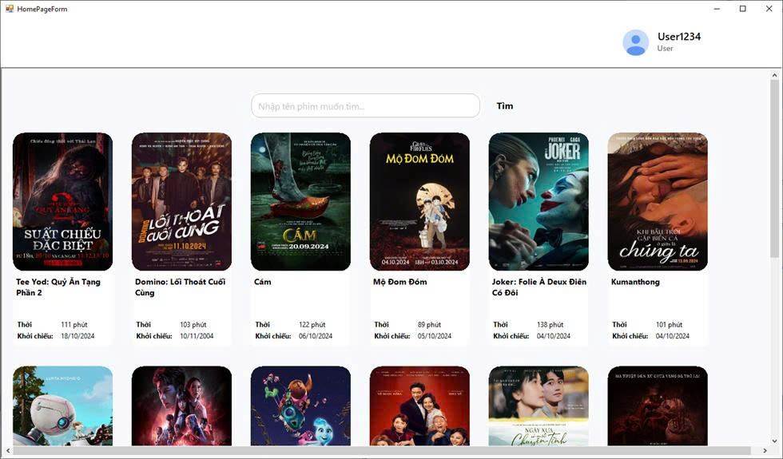
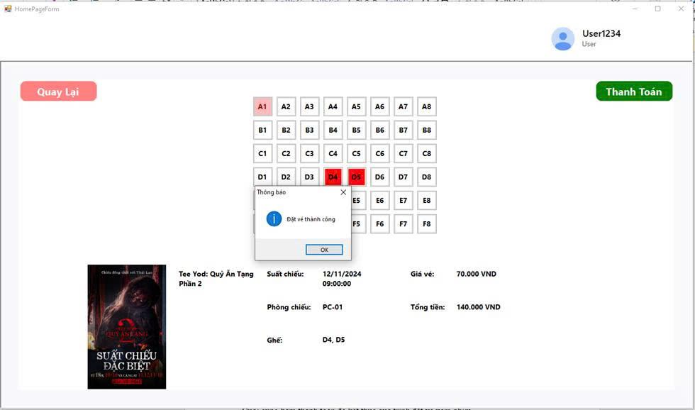
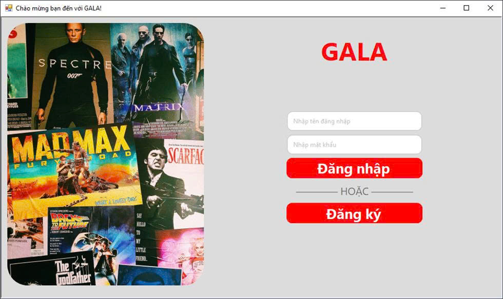
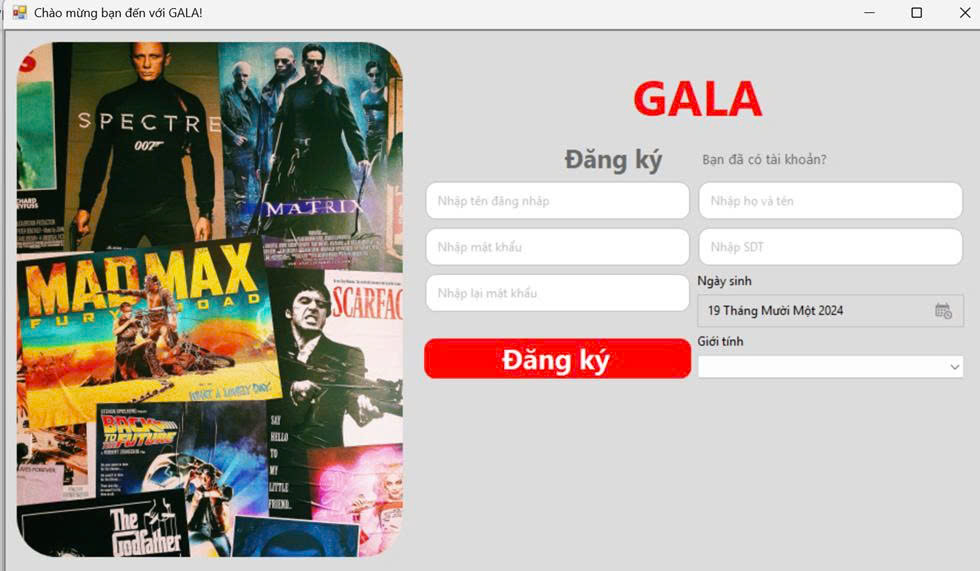
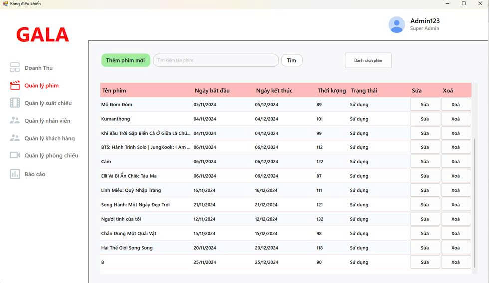
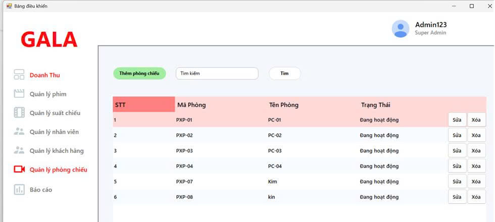
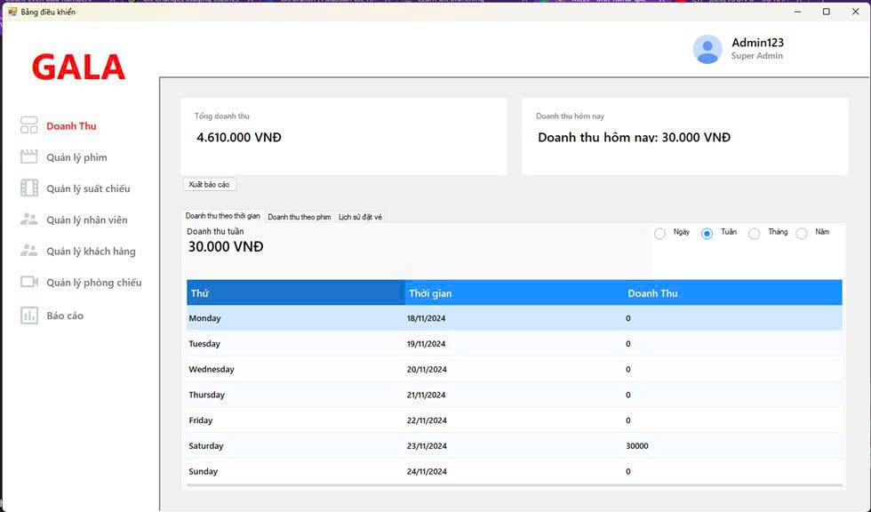
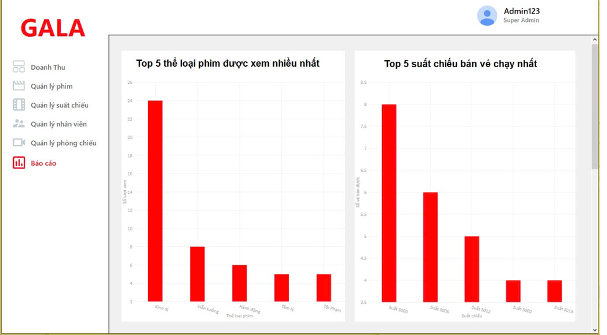

# 🎬 Ứng Dụng Quản Lý Rạp Chiếu Phim **GALA**

Đây là phần mềm **quản lý rạp chiếu phim** được xây dựng bởi **Nhóm 9 - CNTT4 - K63** trong môn học **Lập trình trực quan**. Ứng dụng hỗ trợ cả khách hàng lẫn quản lý trong việc đặt vé, theo dõi suất chiếu, doanh thu và thống kê hoạt động kinh doanh.

---

## 👥 Nhóm thực hiện

| Họ tên               | Mã sinh viên | Công việc chính |
|---------------------|--------------|-----------------|
| Nguyễn Đình Tuấn Anh | 221231039    | Quản lý phim, doanh thu, thiết kế CSDL, vẽ sitemap |
| Trần Văn Giáp        | 221230818    | Giao diện đăng nhập/đăng ký, đặt vé, chỉnh sửa thông tin, thiết kế Figma |
| Nguyễn Tùng Lâm      | 221230892    | Giao diện đăng ký, quản lý suất chiếu, nhân viên, khách hàng, vẽ use-case |
| Trần Kim Anh         | 221230742    | Quản lý phòng chiếu, báo cáo thống kê phim, thiết kế CSDL, chèn dữ liệu và tổng hợp báo cáo |

---

## 🚀 Công nghệ sử dụng

- **Ngôn ngữ chính**: C#
- **Nền tảng**: WinForms (.NET)
- **Backend**: ASP.NET  
- **Cơ sở dữ liệu**: SQL Server
- **Thư viện UI**: Bunifu Framework  
- **Thống kê & biểu đồ**: LiveCharts

---

## 🎯 Tính năng chính

### 👤 Đối với khách hàng:
- Đăng ký, đăng nhập tài khoản
- Tìm kiếm phim & đặt vé theo suất chiếu
- Chọn ghế, thanh toán
- Chỉnh sửa thông tin cá nhân

### 🛠 Đối với quản lý:
- Quản lý nhân viên, phòng chiếu, phim, khách hàng
- Tạo và chỉnh sửa suất chiếu
- Theo dõi và thống kê doanh thu theo ngày/tuần/tháng/năm
- Xuất báo cáo doanh thu ra Excel
- Hiển thị biểu đồ:
  - 🎞️ Top 5 thể loại phim được xem nhiều
  - 🕒 Top 5 suất chiếu bán chạy
  - 🎥 Top 10 phim được xem nhiều nhất

---

---

## 🗺️ Sơ đồ ERD – Thiết kế cơ sở dữ liệu

Dưới đây là sơ đồ thực thể – quan hệ (ERD) mô tả cấu trúc cơ sở dữ liệu của hệ thống:

---

## 📷 Giao diện ứng dụng

Dưới đây là một số giao diện chính của phần mềm Quản lý Rạp Chiếu Phim:

| Chức năng               | Ảnh minh họa             |
|-------------------------|--------------------------|
| 🏠 Trang chủ khách hàng |       |
| 🎟️ Giao diện đặt vé(Khách hàng)     |            |
| 🔐 Giao diện đăng nhập(Khách hàng)  |            |
| 📝 Giao diện đăng ký(Khách hàng)    |           |
| 🎬 Quản lý phim(admin)        |           |
| 🏢 Quản lý phòng chiếu(admin) |          |
| 📊 Giao diện doanh thu(admin)  |          |
| 📈 Thống kê(admin)            |          |

---

## ⚠️ Hạn chế hiện tại

Dù nhóm đã nỗ lực hoàn thiện phần mềm, vẫn còn một số hạn chế nhất định do giới hạn về thời gian và kinh nghiệm:

- **Chức năng khuyến mãi**: chưa được triển khai trong phiên bản hiện tại.
- **Quản lý phim**: một số trường như thể loại, đạo diễn, diễn viên đang phải nhập **thủ công**, chưa hỗ trợ **chọn từ danh sách có sẵn**, dễ gây ra lỗi nhập sai hoặc trùng dữ liệu.
- **Chức năng đặt vé**: được tích hợp trực tiếp trong ứng dụng WinForms. Khách hàng đặt vé ngay trên phần mềm desktop, chưa có hệ thống web hoặc mobile riêng biệt.

> Nhóm mong muốn sẽ tiếp tục cải tiến các chức năng này trong tương lai nếu có cơ hội phát triển thêm.

## 📄 Báo cáo cuối kỳ

🔗 **File PDF:** [Nhóm 9 - CNTT4 - K63.pdf](Nhóm%209%20-%20CNTT4%20-%20K63.pdf)

